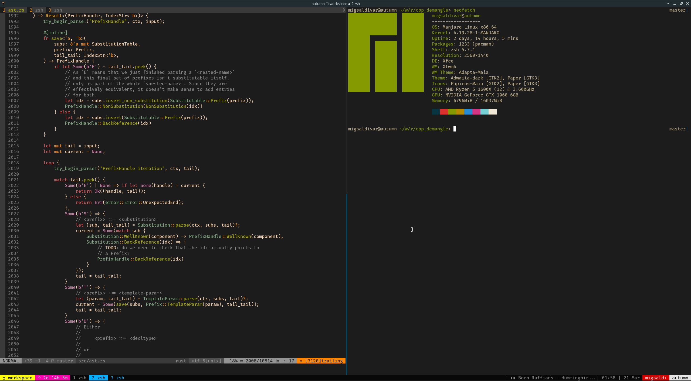

These are my '.' files on manjaro and macOS.

Kitty is my preffered terminal emulator on manjaro, because alacritty has some
issues with neovim and tmux :(

I use neovim w/ vimplug and languageclient-neovim.

